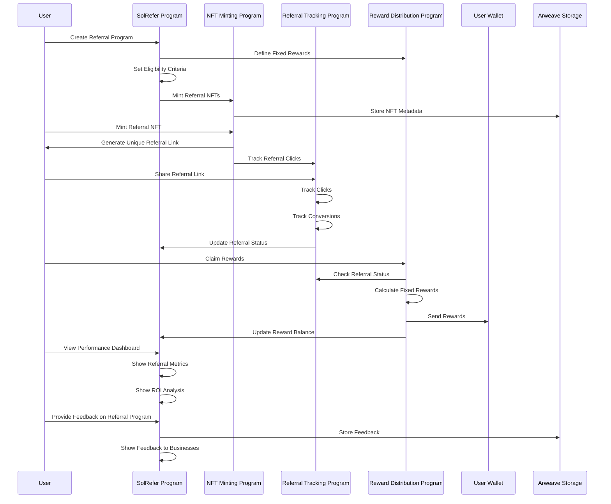

# SolRefer Protocol Architecture

## Core Functions Specification

### 1. Referral Program Management Functions
```rust
// Create a new referral program with specified parameters and fixed reward amount
create_referral_program(program_params: ProgramParams, fixed_reward_amount: u64) -> ProgramId

// Set eligibility criteria for program participation
set_eligibility_criteria(criteria_params: CriteriaParams) -> Result<(), ProgramError>

// Update existing program settings
update_program_settings(program_id: ProgramId, new_settings: ProgramSettings) -> Result<(), ProgramError>
```

### 2. NFT Minting Functions
```rust
// Mint a new referral NFT for a specific program
mint_referral_nft(program_id: ProgramId) -> NftId

// Generate unique referral link for an NFT
generate_referral_link(nft_id: NftId) -> ReferralLink

// Store NFT metadata on Arweave
store_nft_metadata(metadata: Metadata, arweave_connection: ArweaveConnection) -> MetadataId
```

### 3. Referral Tracking Functions
```rust
// Track when a referral link is clicked
track_referral_click(referral_link_id: ReferralLinkId) -> Result<(), ProgramError>

// Record successful conversion for a referral
record_conversion(referral_link_id: ReferralLinkId) -> Result<(), ProgramError>

// Update status of a referral
update_referral_status(referral_id: ReferralId, status: ReferralStatus) -> Result<(), ProgramError>

// Get statistics for a specific referral
get_referral_stats(referral_id: ReferralId) -> ReferralStats
```

### 4. Reward Distribution Functions
```rust
// Calculate rewards based on successful referral count
calculate_fixed_rewards(referral_count: u64) -> u64

// Distribute rewards to user wallet
distribute_rewards(user_wallet: Pubkey, amount: u64) -> Result<(), ProgramError>

// Check if lock period has elapsed for rewards
check_lock_period(referral_id: ReferralId) -> bool

// Process early redemption with fee
process_early_redemption(referral_id: ReferralId) -> Result<u64, ProgramError>

// Update program reward balance
update_reward_balance(program_id: ProgramId) -> Result<(), ProgramError>
```

### 5. Token Management Functions
```rust
// Deposit tokens for rewards
deposit_reward_tokens(program_id: ProgramId, amount: u64) -> Result<(), ProgramError>

// Process fee for minting NFT
process_mint_fee(amount: u64) -> Result<(), ProgramError>

// Manage protocol fee vault
manage_fee_vault(action: VaultAction, amount: u64) -> Result<(), ProgramError>
```

### 6. User Interaction Functions
```rust
// Stake referral NFT in program
stake_referral_nft(nft_id: NftId, program_id: ProgramId) -> Result<(), ProgramError>

// Claim earned rewards
claim_rewards(referral_id: ReferralId) -> Result<u64, ProgramError>

// Get user performance metrics
get_performance_metrics(user_id: Pubkey) -> PerformanceMetrics

// Get dashboard data for program
get_dashboard_data(program_id: ProgramId) -> DashboardData
```

### 7. Account Management Functions
```rust
// Create new program account
create_program_account(owner: Pubkey) -> ProgramAccount

// Create referral tracking account
create_referral_account(program_id: ProgramId) -> ReferralAccount

// Create reward distribution account
create_reward_account(program_id: ProgramId) -> RewardAccount

// Update account state
update_account_state(account_id: Pubkey, new_state: AccountState) -> Result<(), ProgramError>

// Verify account ownership
verify_account_ownership(account_id: Pubkey, owner: Pubkey) -> bool
```

### 8. Storage Functions
```rust
// Store referral metadata
store_referral_metadata(metadata: ReferralMetadata) -> MetadataId

// Store program feedback
store_feedback(program_id: ProgramId, feedback: Feedback) -> FeedbackId

// Retrieve program data
retrieve_program_data(program_id: ProgramId) -> ProgramData

// Update stored metadata
update_stored_metadata(metadata_id: MetadataId, new_data: Metadata) -> Result<(), ProgramError>
```

## Program vs Client Responsibilities

### Program-Side (On-Chain)

#### 1. Core Economic Parameters
- Base reward amount per referral
- Tiered reward structure (2 tiers)
- Maximum reward cap
- Revenue sharing percentages

#### 2. Basic Requirements
- Minimum stake amount validation
- Required token holdings verification
- Token amount verification

#### 3. Time Parameters
- Program start/end time enforcement
- Timestamp validation for rewards

### Client-Side (Off-Chain)

#### 1. Quality Metrics
- Track referred user's activity level
- Monitor user engagement
- Calculate and display conversion rates
- Generate performance analytics

#### 2. Advanced Requirements
- Account age verification
- Geographic restrictions
- User demographics tracking
- Historical performance analysis

#### 3. Analytics Dashboard
- Referral success metrics
- ROI calculations
- Performance visualization
- User behavior analysis

#### 4. User Experience
- Referral link generation and tracking
- User interface for program creation
- Performance dashboards
- Reward claim interface

### Integration Points

1. **Program Creation**
   - Client: Collects and validates program parameters
   - Program: Stores and enforces core economic rules

2. **Referral Processing**
   - Client: Tracks referral link usage and user activity
   - Program: Validates eligibility and processes rewards

3. **Reward Distribution**
   - Client: Displays reward status and claim options
   - Program: Validates and executes reward transfers

4. **Performance Tracking**
   - Client: Comprehensive analytics and reporting
   - Program: Core economic and stake validation

## Protocol Requirements

1. **The protocol shall allow a user to create and manage decentralized referral programs.**
2. **The protocol shall allow a user to mint referral NFTs representing unique referral links.**
3. **The protocol shall allow a user to deposit tokens (e.g., USDC/USDT) to fund referral rewards.**
4. **The protocol shall allow a user to stake referral NFTs to participate in referral programs.**
5. **The protocol shall track referral clicks and conversions programmatically using smart contracts.**
6. **The protocol shall distribute rewards automatically to users based on successful referrals.**
7. **The protocol shall charge a minor mint fee (e.g., 10-50 basis points) for creating referral NFTs.**
8. **The protocol shall store mint fees in a separate fee vault for transparency.**
9. **The protocol shall allow users to claim rewards after a locked period has elapsed.**
10. **The protocol shall charge an early redemption fee if users claim rewards before the locked period ends.**
11. **The protocol shall provide a dashboard for users to track referral performance and ROI.**
12. **The protocol shall store referral metadata (e.g., referral links, rewards) on decentralized storage (e.g., Arweave).**

```mermaid
graph TD
    %% Program Structure Visualization
    subgraph Solana Protocol
        SolRefer[SolRefer Program] -->|Mint Referral NFTs| NFTMinting[NFT Minting Program]
        SolRefer -->|Track Referrals| ReferralTracking[Referral Tracking Program]
        SolRefer -->|Distribute Rewards| RewardDistribution[Reward Distribution Program]
        SolRefer -->|Interact with Users| UserInteraction[User Interaction Program]
    end

    %% Account Structure Mapping
    subgraph Accounts
        NFTAccount[NFT Account] -->|Owned by| User[User Account]
        ReferralAccount[Referral Account] -->|Stores Referral Data| SolRefer
        RewardAccount[Reward Account] -->|Stores Reward Tokens| SolRefer
        PDA[Program Derived Address] -->|Derived from| SolRefer
    end

    %% External Dependencies and Integrations
    subgraph External Systems
        Wallet[Phantom Wallet] -->|User Interaction| SolRefer
        Arweave[Arweave Storage] -->|Store Metadata| NFTMinting
    end

    %% User Interaction Flow
    subgraph User Flow
        User -->|Create Referral Program| SolRefer
        User -->|Mint Referral NFT| NFTMinting
        User -->|Track Referrals| ReferralTracking
        User -->|Claim Rewards| RewardDistribution
    end

    %% Program Interaction Matrix
    SolRefer -->|Cross-Program Invocation| NFTMinting
    SolRefer -->|Cross-Program Invocation| ReferralTracking
    SolRefer -->|Cross-Program Invocation| RewardDistribution
    SolRefer -->|Cross-Program Invocation| UserInteraction

    %% Account Management
    SolRefer -->|Create Account| NFTAccount
    SolRefer -->|Update State| ReferralAccount
    SolRefer -->|Transfer Ownership| RewardAccount
    SolRefer -->|Derive PDA| PDA

    %% External Integrations
    SolRefer -->|Connect Wallet| Wallet
    SolRefer -->|Store Metadata| Arweave

    %% Legend
    subgraph Legend
        Program[Program] -->|Interaction| AnotherProgram[Another Program]
        Account[Account] -->|Owned by| UserAccount[User Account]
        External[External System] -->|Integration| SolanaProtocol[Solana Protocol]
    end

    %% Styling
    classDef program fill:#f9f,stroke:#333,stroke-width:2px;
    classDef account fill:#bbf,stroke:#333,stroke-width:2px;
    classDef external fill:#f96,stroke:#333,stroke-width:2px;
    classDef user fill:#9f9,stroke:#333,stroke-width:2px;
    classDef legend fill:#fff,stroke:#333,stroke-width:1px;

    class SolRefer,NFTMinting,ReferralTracking,RewardDistribution,UserInteraction program;
    class NFTAccount,ReferralAccount,RewardAccount,PDA account;
    class Wallet,Arweave external;
    class User user;
    class Legend legend;
```





```mermaid
graph TD
    %% Scenario 1: Create Referral Program
    subgraph CreateReferralProgram[Create Referral Program]
        User1[User] -->|Create Referral Program| SolRefer[SolRefer Program]
        SolRefer -->|Define Fixed Rewards| RewardDefinition[Reward Definition]
        SolRefer -->|Set Eligibility Criteria| EligibilityCriteria[Eligibility Criteria]
        SolRefer -->|Mint Referral NFTs| NFTMinting[NFT Minting Program]
        SolRefer -->|Store Metadata| Arweave[Arweave Storage]
    end

    %% Scenario 2: Mint Referral NFT
    subgraph MintReferralNFT[Mint Referral NFT]
        User2[User] -->|Mint Referral NFT| NFTMinting
        NFTMinting -->|Generate Unique Referral Link| ReferralLink[Referral Link]
        NFTMinting -->|Store NFT Metadata| Arweave
        NFTMinting -->|Track Referral Clicks| ReferralTracking[Referral Tracking Program]
    end

    %% Scenario 3: Track Referrals
    subgraph TrackReferrals[Track Referrals]
        User3[User] -->|Share Referral Link| ReferralTracking
        ReferralTracking -->|Track Clicks| ClickTracking[Click Tracking]
        ReferralTracking -->|Track Conversions| ConversionTracking[Conversion Tracking]
        ReferralTracking -->|Update Referral Status| ReferralStatus[Referral Status]
    end

    %% Scenario 4: Distribute Rewards
    subgraph DistributeRewards[Distribute Rewards]
        User4[User] -->|Claim Rewards| RewardDistribution[Reward Distribution Program]
        RewardDistribution -->|Check Referral Status| ReferralStatus
        RewardDistribution -->|Calculate Fixed Rewards| RewardCalculation[Reward Calculation]
        RewardDistribution -->|Send Rewards| Wallet[User Wallet]
        RewardDistribution -->|Update Reward Balance| RewardBalance[Reward Balance]
    end

    %% Scenario 5: Monitor Referral Program Performance
    subgraph MonitorPerformance[Monitor Referral Program Performance]
        User5[User] -->|View Performance Dashboard| PerformanceDashboard[Performance Dashboard]
        PerformanceDashboard -->|Show Referral Metrics| ReferralMetrics[Referral Metrics]
        PerformanceDashboard -->|Show ROI Analysis| ROIAnalysis[ROI Analysis]
    end

    %% Scenario 6: Provide Feedback on Referral Programs
    subgraph ProvideFeedback[Provide Feedback on Referral Programs]
        User6[User] -->|Rate and Review Referral Programs| FeedbackSystem[Feedback System]
        FeedbackSystem -->|Store Feedback| Arweave
        FeedbackSystem -->|Show Feedback to Businesses| BusinessFeedback[Business Feedback]
    end

    %% Legend
    subgraph Legend
        User[User] -->|Interaction| Program[Program]
        Program -->|Data Storage| Storage[Storage]
        Program -->|External Integration| External[External System]
    end

    %% Styling
    classDef user fill:#9f9,stroke:#333,stroke-width:2px;
    classDef program fill:#f9f,stroke:#333,stroke-width:2px;
    classDef storage fill:#bbf,stroke:#333,stroke-width:2px;
    classDef external fill:#f96,stroke:#333,stroke-width:2px;
    classDef legend fill:#fff,stroke:#333,stroke-width:1px;

    class User1,User2,User3,User4,User5,User6 user;
    class SolRefer,NFTMinting,ReferralTracking,RewardDistribution,PerformanceDashboard,FeedbackSystem program;
    class Arweave storage;
    class Wallet external;
    class Legend legend;
