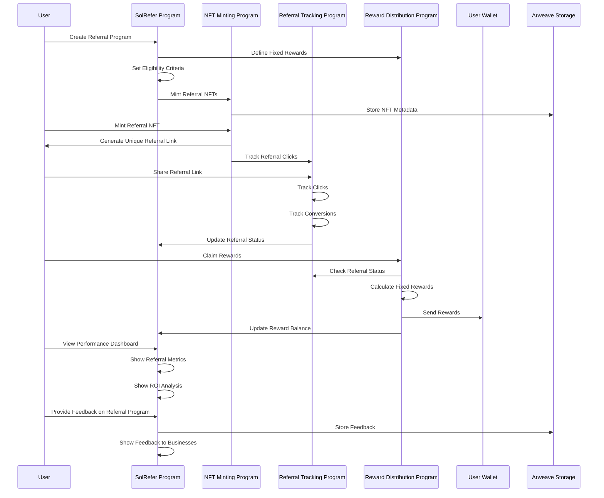

# SolRefer Protocol

A decentralized referral program protocol built on Solana that enables businesses to create and manage referral programs using NFTs.

## Overview

SolRefer allows users to:
- Create and manage decentralized referral programs
- Mint NFTs that represent unique referral links
- Track referrals and conversions on-chain
- Distribute rewards automatically
- Monitor performance through a dashboard

## Key Features

- **NFT-Based Referrals**: Each referral link is represented by a unique NFT
- **Flexible Rewards**: Support for both SOL and custom token rewards
- **Automatic Distribution**: Smart contract-based reward distribution
- **Performance Tracking**: On-chain tracking of clicks and conversions
- **Decentralized Storage**: Metadata stored on Arweave for permanence

## Core Components

1. **Referral Program Management**
   - Create and configure referral programs
   - Set eligibility criteria and reward parameters

2. **NFT Minting**
   - Generate unique referral NFTs
   - Store metadata on Arweave

3. **Referral Tracking**
   - Track clicks and conversions
   - Monitor referral status

4. **Reward Distribution**
   - Automatic reward calculations
   - Configurable lock periods
   - Early redemption options

## Protocol Flow



## Getting Started

1. Install dependencies:
   ```bash
   anchor build
   ```

2. Run tests:
   ```bash
   anchor test
   ```

3. Deploy program:
   ```bash
   anchor deploy
   ```

## Architecture

For detailed technical specifications and architecture diagrams, see [Architecture.md](Architecture.md).

## License

[Add License Information]
